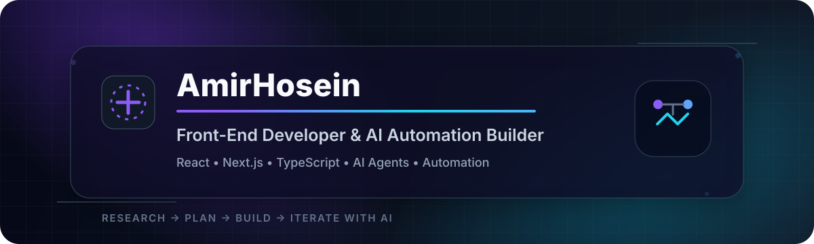

 

### Front-End × AI × Automation

**I build fast, learn faster, and iterate constantly.**

---

## About Me

I'm **AmirHosein**, a self-taught **Front-End Developer & AI Automation Builder** based in Iran.

For the past **2–4 years**, I've been learning by building real projects, experimenting with new technologies, and improving through constant iteration. I enjoy combining modern front-end engineering with AI to turn ideas into useful, intelligent products.

I'm especially interested in:

- Modern web products and rich user experiences
- AI agents, LLM-powered workflows, and automation
- SaaS products and open-source ideas
- New tools that make engineering faster and smarter
- Building, testing, researching, and refining real-world products

> **Fun fact:** I learn best by shipping real things, breaking assumptions, researching better approaches, and rebuilding them stronger.

---

## Current Role — Ziprin

I'm currently working at **[Ziprin](https://ziprin.com)** as a **Front-End Developer & AI-Assisted Engineer**.

Ziprin is being built as a **large-scale marketplace focused on luxury building materials and construction products**.

My work is centered on pushing the front-end experience forward while using AI heavily throughout the development process for research, planning, implementation, and iteration.

### AI tools I use regularly

- **Cursor**
- **OpenAI Codex**
- **ChatGPT**

---

## My AI Development Workflow

### 🔎 Research → 🧭 Plan → ⚡ Build → 🔁 Iterate with AI

I use AI as part of the engineering workflow, not as a replacement for engineering judgment. The goal is to research faster, prototype smarter, reduce repetitive work, and spend more time improving the product.

---

## Tech Stack

### Front-End

  

### AI & Automation

  
  
  
  

### Tools

  
  

---

## Currently Working On

- Building and improving the front-end experience at **Ziprin**
- Combining **Front-End engineering + AI-assisted development**
- Exploring smarter automation workflows
- Turning research and ideas into production-ready interfaces

---

## Currently Learning

- Advanced **Next.js** and modern front-end architecture
- **AI Agents**
- **Automation with n8n**
- Better ways to integrate AI into software-development workflows

---

## Collaboration

I'm open to serious collaboration around:

- **AI & Automation**
- **Open Source**
- **SaaS / Product ideas**

---

## GitHub Stats

 

---

## Contact

 

**Iran · Front-End Developer · AI Automation Builder**

 

